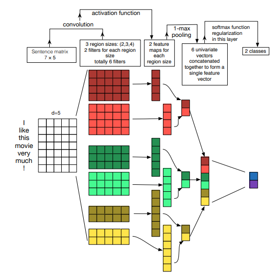
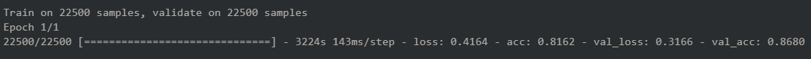

# CNN-for-Text-Classification
### An implementation of a Conv Neural Network for Text classification.
### Original Paper by Ye Zhang and Byron C. Wallace in: A Sensitivity Analysis of (and Practitioners’ Guide to) Convolutional
Neural Networks for Sentence Classification

